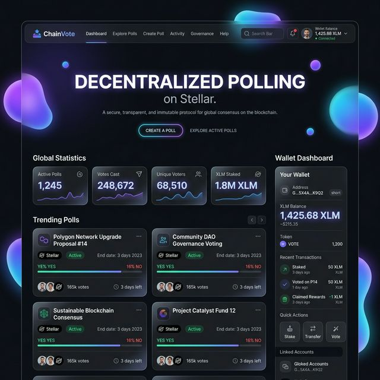
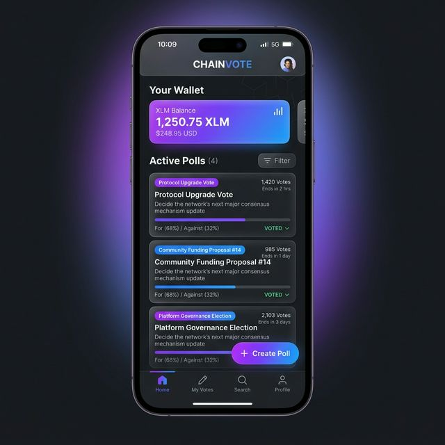

# ⬡ NexusPoll — On-Chain Governance for the Future

> Decentralized, unstoppable polling powered by **Stellar Soroban Smart Contracts**. Every vote is immutable, transparent, and tamper-proof on-chain.

[](https://github.com/shritesh263/Nexsuspoll/actions/workflows/ci.yml)
[](https://stellar-wallet-connect.vercel.app)

## 🌐 Live Demo
**🔗 [Click here to view live](https://stellar-wallet-connect.vercel.app)**

<p align="center">
  
</p>

---

## 🌟 Features
| Feature | Description |
|---|---|
| **Inter-Contract Architecture** | `NexusPoll` contract calls `Vault` contract via cross-contract invocation |
| **Multi-Wallet Support** | Integrated with **Freighter** and **Albedo** wallet extensions |
| **Soroban Smart Contracts** | Core governance logic powered by Rust-based Soroban VM |
| **Cyberpunk Neon UI** | Aurora dark theme with teal neon accents, grid overlay & micro-animations |
| **Mobile Responsive** | Fluid layout for iPhone, Android, and all screen sizes |
| **Rust WASM Module** | Real-time trust scoring via client-side WebAssembly |

---

## 📁 Project Structure
```
.
├── index.html              # Core application interface (NexusPoll)
├── app.js                  # Application logic & blockchain integration
├── style.css               # Production-grade cyberpunk neon styles
├── wasm_utils.wasm         # Compiled Rust logic for trust scores
│
├── contract/               # Soroban Smart Contracts (Rust)
│   ├── src/lib.rs          # NexusPoll (Core) & Vault (Treasury) implementation
│   ├── Cargo.toml          # Dependency management
│   └── deploy.sh           # Testnet deployment automation
│
├── wasm_utils/             # Rust utility source
├── media/                  # Screenshots & assets
└── .github/workflows/      # CI/CD Pipelines (ci.yml, test.yml, deploy.yml)
```

---

## ⛓️ Advanced Architecture: Inter-Contract Calls
NexusPoll implements a modular dual-contract architecture:
- **NexusPoll (Core)**: Handles poll lifecycle, voting authentication, and event emission.
- **Vault (Treasury)**: Acts as a central protocol treasury for creation fees.
- **The Flow**: When a new poll is deployed, `NexusPoll` triggers an **Inter-Contract Call** to `Vault::deposit`, charging a protocol creation fee and demonstrating real cross-contract state transitions on Soroban.

---

## 🧪 Smart Contract Verification
1. **Inter-contract Logic**: Verifies that successful poll creation updates the Vault treasury balance.
2. **Authentication**: `require_auth()` ensures only legitimate voters can cast ballots.
3. **Prevention**: Built-in guards against double-voting and re-initialization.

**Run tests locally:**
```bash
cd contract
cargo test
```

---

## ✅ Level 4 Deliverables Checklist
- [x] **Advanced Contract Implementation** — Production-ready with 6+ core functions.
- [x] **Inter-contract Call Working** — Automated treasury deposits on-chain via `Vault::deposit`.
- [x] **Custom Token/Pool Integration** — XLM native balance dashboard with send functionality.
- [x] **CI/CD Pipeline** — Automated testing & build via GitHub Actions (3 workflows).
- [x] **Mobile Responsive** — Fluid layout for all screen sizes with media breakpoints.
- [x] **Meaningful Commit History** — Feature-driven development (8+ commits).
- [x] **Live Demo** — Deployed and accessible on Vercel.

---

## 📱 Mobile Responsive View
<p align="center">
  
  <br><em>Optimized for mobile: Touch-friendly actions and responsive grid layout.</em>
</p>

---

## 🚀 Deployment Guide

### 1. Deploy to Vercel
1. Go to [Vercel](https://vercel.com/import/git) and connect your GitHub repo.
2. Vercel will auto-detect settings. Click **Deploy**.
3. Copy your URL and update the Live Demo link above.

### 2. CI/CD Pipeline
Three GitHub Actions workflows are included:
- `ci.yml` — Main build & lint pipeline
- `test.yml` — Smart contract test runner (`cargo test`)
- `deploy.yml` — Automated Vercel deployment

### 3. Smart Contract Deployment
```bash
cd contract
stellar contract deploy --wasm target/wasm32-unknown-unknown/release/contract.wasm \
  --source <your-key> --network testnet
```

---

<p align="center">
  <strong>Built for the Stellar Development Challenge · 2026 · NexusPoll Protocol</strong>
</p>
